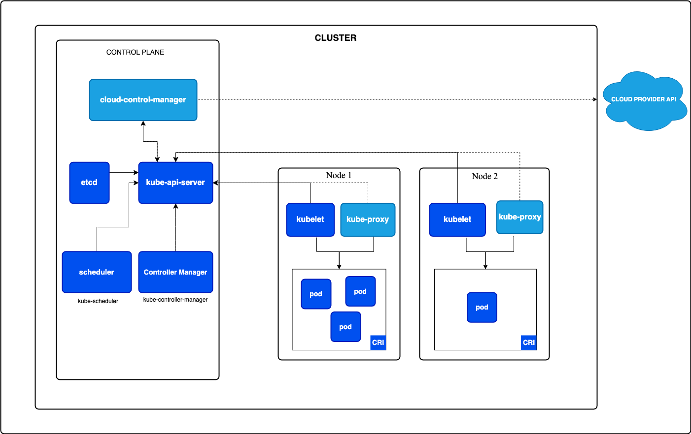

# Kubernetes

It is an open source container orchestration tool, originally started by Google, today part of the Cloud Native Computing Foundation (CNCF) project.

## Why we need container orchestrators?

Applications and Services need to meet specific requirements:

* Fault-tolerance
* On-demand scalability
* Optimal resource usage
* Auto-discovery to automatically discover and communicate with each other
* Accessibility from the outside world
* Seamless updates/rollbacks without any downtime.

These are tools which group systems together to form clusters where containers' deployment and management is automated at scale while meeting the requirements mentioned above.

*Kubernetes is an open-source system for automating deployment, scaling, and management of containerized application.*

Kubernetes comes from the Greek word `κυβερνήτης`, which means helmsman or ship pilot. With this analogy in mind, we can think of Kubernetes as the pilot on a ship of containers.

## Key Features

### Deployment:
we define the desired state of our application, k8s takes care of scheduling of containers on the appropriate nodes depending upon the resource availability and affinity rules

### Scaling:
depending upon the scaling rules and policies k8s will scale in or scale out based on CPU utilization, memory usage or any custom metric we define.

### Health Monitoring:
k8s continuously monitors the health of the container, if the container becomes unhealthy, crashes or unreachable k8s will restart the container automatically

### Rolling update and Rollbacks:
k8s support rolling updates, allowing you to update containerized applications without downtime.

### Networking:
They provide features like service discovery and load balancing, allowing containers to communicate with each other easily. Containers can be grouped together as services and exposed via a single endpoint, simplifying networking configurations.

## Architecture

At a very high level, Kubernetes is a cluster of compute systems categorized by their distinct roles:

* One or more control plane nodes
* One or more worker nodes (optional, but recommended).

### Worker Node Overview

| Component         | Description                                                                                                                                                                                                                                                                                                                                              |
|-------------------|----------------------------------------------------------------------------------------------------------------------------------------------------------------------------------------------------------------------------------------------------------------------------------------------------------------------------------------------------------|
| Pods              | A Pod is the smallest scheduling work unit in Kubernetes. It is a logical collection of one or more containers scheduled together                                                                                                                                                                                                                        |
| Container runtime | The container runtime is the underlying software that is used to run containers on worker node.   It is responsible for pulling the container images from registry, starting and stopping the containers, managing the container resources etc                                                                                                       |
| kubelet           | The `kubelet` is an agent running on each node, control plane and workers, and it communicates with the control plane. It receives Pod definitions, primarily from the API Server, and interacts with the container runtime on the node to run containers associated with the Pod. It also monitors the health and resources of Pods running containers. |
| kube-proxy        | It is a networking proxy that run on each worker node. It is responsible for routing traffic to correct pods.   It also provides load balancing for the pods and ensures the traffic is evenly distributed across the pods.                                                                                                                          |

### Control Plane Node Components

Control Plane Node is the brain behind all operations inside the cluster

| Component       | Description                                                                                                                                                                                                                                                                                                                                                                                                                                                                                                                                                                                                                                                                                                                                                                                                                                                                                                                                                                                                   |
|-----------------|---------------------------------------------------------------------------------------------------------------------------------------------------------------------------------------------------------------------------------------------------------------------------------------------------------------------------------------------------------------------------------------------------------------------------------------------------------------------------------------------------------------------------------------------------------------------------------------------------------------------------------------------------------------------------------------------------------------------------------------------------------------------------------------------------------------------------------------------------------------------------------------------------------------------------------------------------------------------------------------------------------------|
| API Server      | Primary interface between control plane and rest of the cluster.   It exposes a RESTful API that allows client to interact with control plane and submit requests to manage the cluster.   During processing the API Server reads the Kubernetes cluster's current state from the key-value store, and after a call's execution, the resulting state of the Kubernetes cluster is saved in the key-value store for persistence.                                                                                                                                                                                                                                                                                                                                                                                                                                                                                                                                                                       |
| etcd            | `etcd` is an open source project under the Cloud Native Computing Foundation (CNCF). etcd is a strongly consistent, distributed key-value data store used to persist a Kubernetes cluster's state.   It is used by the API server and other components of control plane to store and retrieve information about the cluster.                                                                                                                                                                                                                                                                                                                                                                                                                                                                                                                                                                                                                                                                              |                                                                                                                                                                                                                           
| Scheduler       | The scheduler is responsible for scheduling pods on to the worker nodes in the cluster.   It uses the information about the resources required by the pods and the resources available on the worker nodes to make placement decisions.   The scheduler obtains from the key-value store, via the API Server, resource usage data for each worker node in the cluster.   The scheduler also takes into account Quality of Service (QoS) requirements, data locality, affinity, anti-affinity, taints, toleration, cluster topology, etc.   Once all the cluster data is available, the scheduling algorithm filters the nodes with predicates to isolate the possible node candidates which then are scored with priorities in order to select the one node that satisfies all the requirements for hosting the new workload.   The outcome of the decision process is communicated back to the API Server, which then delegates the workload deployment with other control plane agents. |
| Control mangers | It is responsible for running controllers that manages the state of the cluster. Example: ReplicationController - manages the desired number of replicas of a pod are running.   Controllers are watch-loop processes continuously running and comparing the cluster's desired state (provided by objects' configuration data) with its current state (obtained from the key-value store via the API Server). In case of a mismatch, corrective action is taken in the cluster until its current state matches the desired state.                                                                                                                                                                                                                                                                                                                                                                                                                                                                         |
