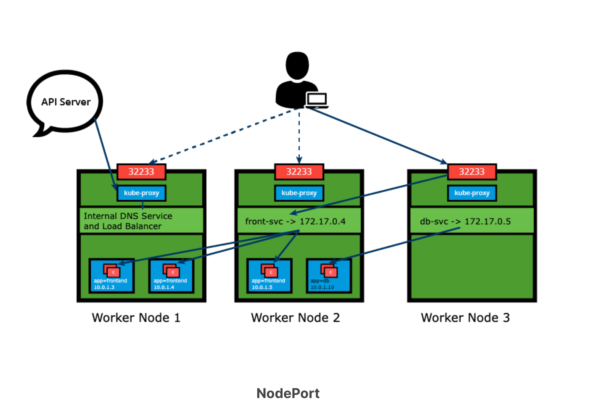
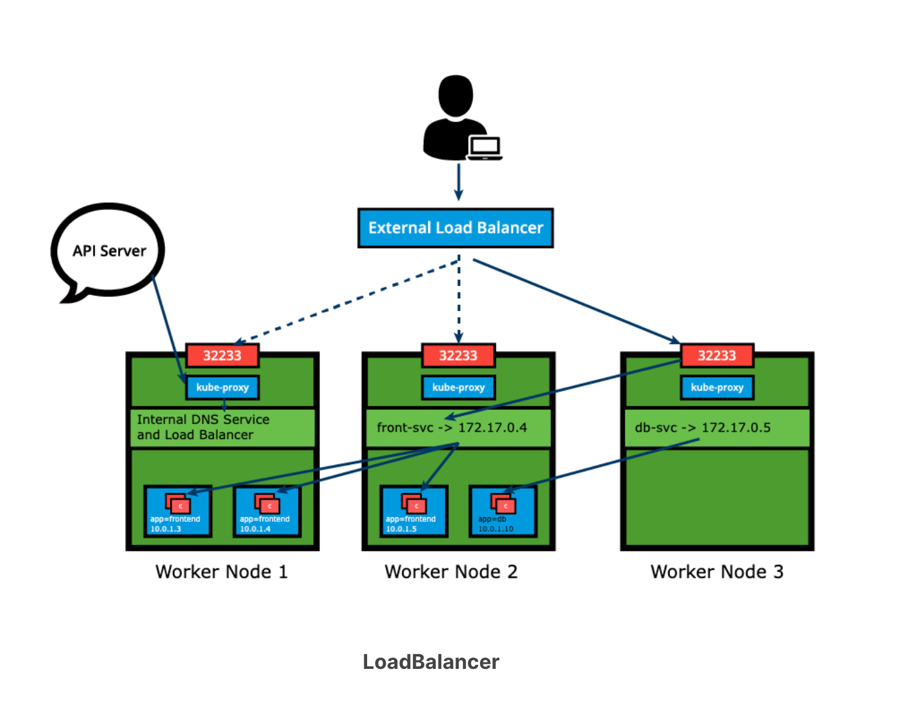

# Service


## Why services?
* To access the application, a user or another application needs to connect to a Pod running the target application. As Pods are ephemeral in nature, resources like IP addresses allocated to them cannot be static. Pods could be terminated abruptly or be rescheduled based on existing requirements.
* To overcome this situation, Kubernetes provides a higher-level abstraction called Service, which logically groups Pods and defines a policy to access them. This grouping is achieved via Labels and Selectors. 
* Service objects used to abstract the communication between cluster internal microservices, or with the external world. 
* A Service offers a single DNS entry for a stateless containerized application managed by the Kubernetes cluster, regardless of the number of its replicas, by providing a common load balancing access point to a set of pods logically grouped and managed by a controller such as a Deployment, ReplicaSet.

## Types of services
While defining a Service, we can also choose its access scope. We can decide whether the Service:

* Is only accessible within the cluster.
* Is accessible from within the cluster and the external world.
* Maps to an entity which resides either inside or outside the cluster.

### 1. Cluster IP

* ClusterIP is the default ServiceType. A Service receives a Virtual IP address, known as its ClusterIP.
* This Virtual IP address is used for communicating with the Service and is accessible only from within the cluster. 

```yaml
apiVersion: v1
kind: Service
metadata:
  name: frontend-svc
spec:
  selector:
    app: frontend
  ports:
  - protocol: TCP
    port: 80 # Port on which the application running
    targetPort: 5000 # Service port
  type: ClusterIP
```

### 2. Node port

* With the NodePort ServiceType, in addition to a ClusterIP, a high-port, dynamically picked from the default range `30000-32767`, is mapped to the respective Service, from all the worker nodes. 
* For example, if the mapped NodePort is 32233 for the service frontend-svc, then, if we connect to any worker node on port 32233, the node would redirect all the traffic to the assigned ClusterIP - 172.17.0.4.
* If we prefer a specific high-port number instead, then we can assign that high-port number to the NodePort from the default range when creating the Service. 



```yaml
apiVersion: v1
kind: Service
metadata:
  name: frontend-svc
spec:
  selector:
    app: frontend
  ports:
  - protocol: TCP
    port: 80 # Port on which the application running
    targetPort: 5000 # Service port
    nodePort: 32233 # Node port
  type: NodePort
```

### 3. LoadBalancer

* NodePort and ClusterIP are automatically created, and the external load balancer will route to them.
* The Service is exposed at a static port on each worker node.
* The Service is exposed externally using the underlying cloud provider's load balancer feature.



```yaml
apiVersion: v1
kind: Service
metadata:
  name: frontend
  labels:
    app: guestbook
    tier: frontend
spec:
  type: LoadBalancer
  ports:
    - port: 80
  selector:
    app: guestbook
    tier: frontend
```

* The LoadBalancer ServiceType will only work if the underlying infrastructure supports the automatic creation of Load Balancers and have the respective support in Kubernetes, as is the case with the Google Cloud Platform and AWS. 
* If no such feature is configured, the LoadBalancer IP address field is not populated, it remains in Pending state, but the Service will still work as a typical NodePort type Service.